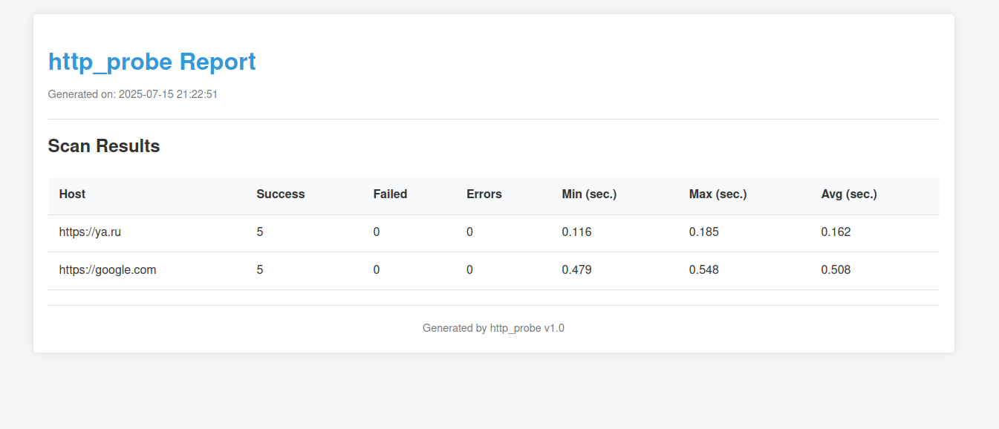

# http_probe
> CLI utility for checking the availability of HTTP servers

#### Features  
- Multiple Hosts Support (accepts a list of hosts via command-line arguments or from a file)
- Customizable Request Count (allows specifying the number of requests per host)
- Progress Tracking (displays real-time progress during execution)
- Asynchronous Execution (uses `aiohttp` for efficient parallel request handling)
- HTML Report Generation (optionally generates an HTML report for visualizing results):
    

#### Usage
1) Install dependances:
```shell
pip install -r requirements.txt
```
2) Just use CLI:
    - Test multiple hosts with default settings:
        ```shell
        python main.py -H https://ya.ru,https://google.com 
        ```
    - Specify request count per host:
        ```shell
        python main.py -H https://ya.ru,https://google.com -C 5
        ```
    - Read hosts from file:
        ```shell
        python main.py -F hosts.txt
        ```
    - Generate an HTML report:
        ```shell
        python main.py -H https://ya.ru,https://google.com -C 5 -O results.html
        ```
In any way CLI prints results in stdout:
```shell
########## RESULTS ##########
[ https://ya.ru  ]:
        - Success: 4
        - Failed: 1
        - Errors: 0
        - Min: 0.234 sec.
        - Max: 0.567 sec.
        - Avg: 0.345 sec.

[ https://google.com  ]:
        - Success: 5
        - Failed: 0
        - Errors: 0
        - Min: 0.123 sec.
        - Max: 0.345 sec.
        - Avg: 0.234 sec.
```